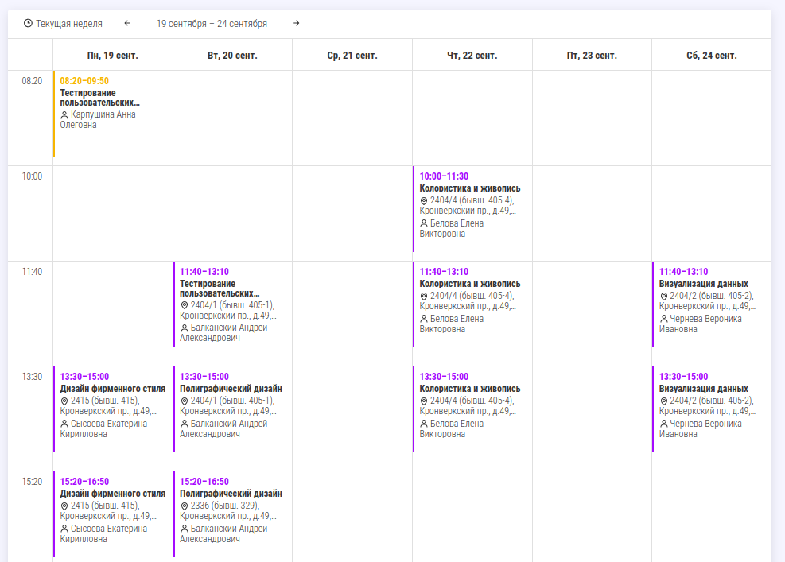

Сайт для просмотра базы данных студентов и их персонального расписания.

Стек:
 - Бекенд: Spring Flux, PostgreSQL, jOOQ
 - Фронтенд: React

Поддерживается расширенный поиск с логическими операторами и функциями, пример:

```
НЕ факультет:БИТ курс:(2 или 3) Абдулла
```


